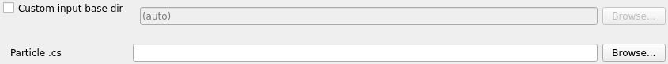
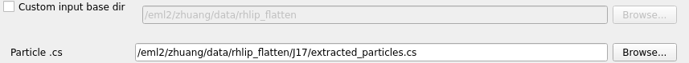
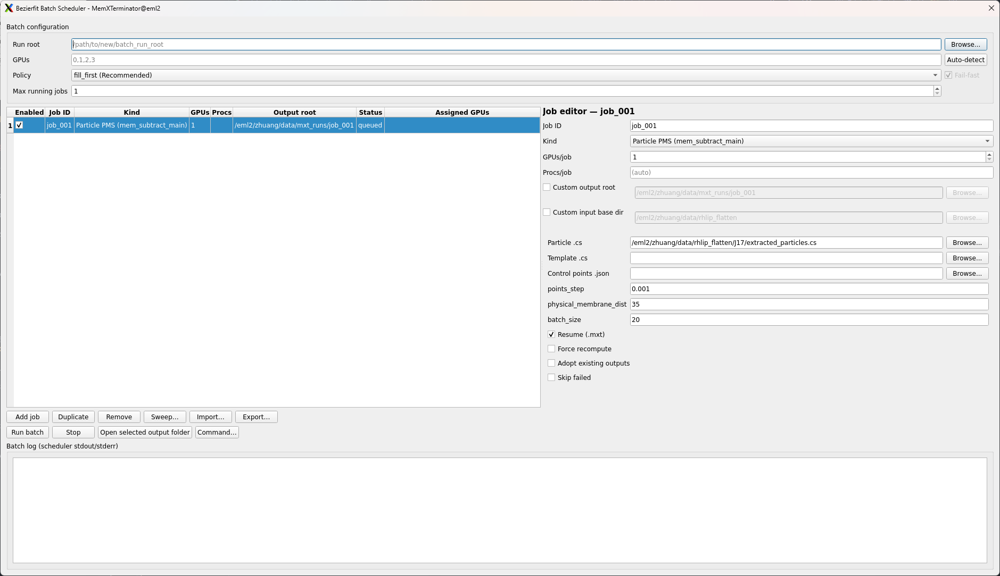
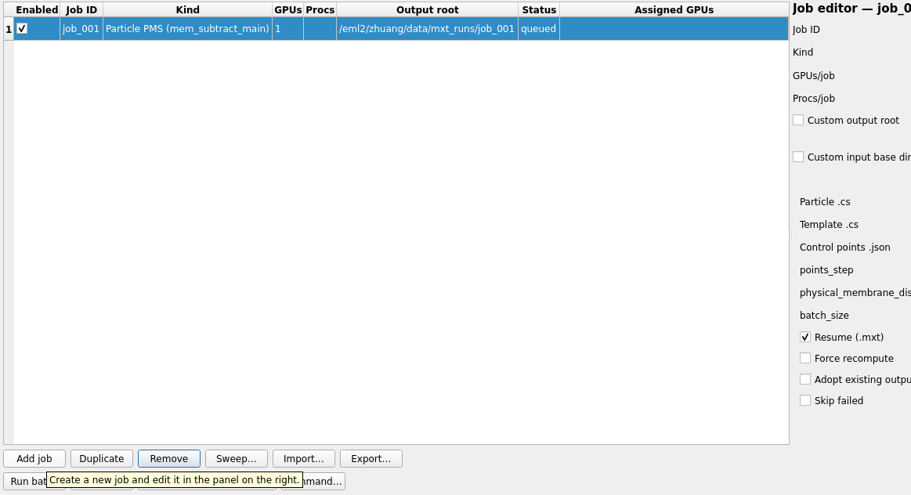
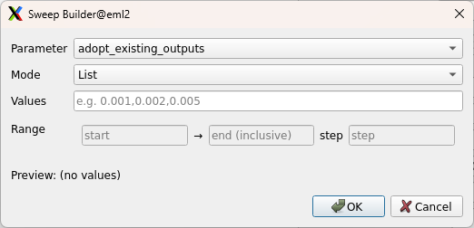
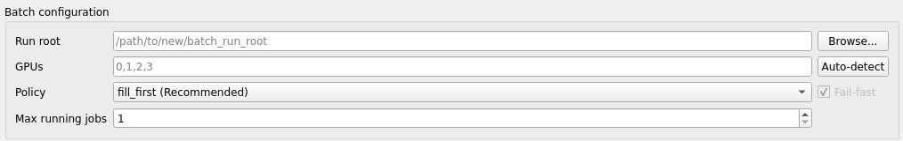
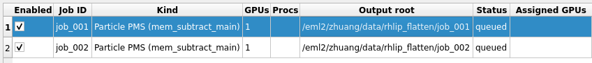

# Bezierfit Batch Scheduler

## 1 Introduction

The Bezierfit Batch Scheduler allows you to run multiple membrane subtraction jobs in parallel with intelligent GPU resource management. This is especially useful when you need to:

* Process multiple datasets simultaneously
* Run parameter sweeps to find optimal settings (e.g., different `points_step` values)
* Coordinate dependent workflows (e.g., run Particle Membrane Subtraction first, then Micrograph Membrane Subtraction)

The scheduler handles GPU allocation automatically, ensuring jobs don't compete for the same GPU resources.

!!! Note "Prerequisites"
    This tutorial assumes MemXTerminator is already installed and usable on your system.
    If not, please follow the [Installation](../installation.md) tutorial first.

For single-job runs, continue to use the standard [Particle Membrane Subtraction](./bezierfit-particle-mem-subtraction.md) and [Micrograph Membrane Subtraction](./bezierfit-mms.md) interfaces.

## 2 Core Concepts

### 2.1 Job-Level Parallelism

The Batch Scheduler runs multiple independent jobs concurrently. Each job is a complete membrane subtraction task (Particle PMS, Micrograph MMS, or Membrane Analysis) with its own parameters and output directory.

Unlike single-job parallelism (where one job uses multiple GPUs/processes), job-level parallelism lets you queue many jobs and have them execute automatically as GPU resources become available.

### 2.2 GPU Scheduling

The scheduler manages a pool of available GPUs and allocates them to jobs based on your configuration:

* **`gpus`**: A list of GPU IDs available to the scheduler (e.g., `[0, 1, 2, 3]`). These correspond to the physical GPU indices on your system.
* **`max_running_jobs`**: Maximum number of jobs that can run simultaneously.
* **`policy`**: How GPUs are assigned to jobs:
    * `fill_first` (default): Assigns jobs to the lowest-index available GPUs first. Good for keeping some GPUs free for other users.
    * `round_robin`: Spreads jobs evenly across GPUs in rotation. Good for balanced utilization.

Internally, the scheduler sets `CUDA_VISIBLE_DEVICES` for each job, so the job only sees its assigned GPU(s).

### 2.3 Output Isolation

Each job writes to its own isolated directory specified by `output_root`. This prevents jobs from interfering with each other and makes it easy to compare results from different parameter settings.

### 2.4 Input Base Directory

CryoSPARC `.cs` files and STAR files often contain **relative paths** (e.g., `J220/extract/particles.mrcs`). Because the batch scheduler runs each job with its working directory set to `<output_root>`, these relative paths may fail to resolve correctly, resulting in `FileNotFoundError`.

The `input_base_dir` argument solves this by specifying the directory from which relative paths inside the input files should be resolved:

* **Auto-inference (default)**: The scheduler automatically infers `input_base_dir` from your primary input file. For CryoSPARC layouts (where the `.cs` or `.star` file lives directly under a `J###/` folder), it infers the parent directory of that `J###/` folder (e.g., `/data/project/` if the input is `/data/project/J220/particles_selected.cs`).
* **Manual override**: You can explicitly set `input_base_dir` if the auto-inferred value is incorrect or if your file layout differs from the standard CryoSPARC structure.

{: .small}

{: .small}
<span class="caption">Auto-parse Input Base Directory</span>

For example, if you run two PMS jobs with different `points_step` values, you might use:

* Job 1: `output_root = /runs/pms_step_0.001`
* Job 2: `output_root = /runs/pms_step_0.002`

The subtracted particle stacks will appear under `<output_root>/subtracted/...` for each job.

## 3 Using the GUI

### 3.1 Open the Interface

Open the MemXTerminator main program, select the `Bezierfit` mode, then click `Batch Scheduler` to enter the Batch Scheduler interface:

{: .small}
<span class="caption">Bezierfit Batch Scheduler interface</span>

### 3.2 Add Jobs

Click `Add job` to create a new job entry. You can add multiple jobs of different types:

* **Particle PMS** - Particle Membrane Subtraction
* **Micrograph MMS** - Micrograph Membrane Subtraction
* **Membrane Analyze** - Bezier curve fitting on 2D averages

{: .small}
<span class="caption">Adding a new job to the batch</span>

For each job, configure:

* **Job ID**: A unique identifier (letters, numbers, underscores, periods, hyphens)
* **Output Root**: Directory where this job's outputs will be written
* **GPUs**: Number of GPUs required by this job
* **Procs**: Number of worker processes (defaults to number of GPUs)
* **Input Base Dir**: Base directory for resolving relative paths in input files (see below)
* **Job-specific parameters**: File paths and processing options

!!! Note "Per-Job Input Base Directory"
    Each job has an **Input Base Dir** field with a **Custom input base dir** checkbox and a **Browse** button.

    - **Default (recommended)**: Leave **Custom input base dir** unchecked. The field shows the auto-inferred value (read-only) based on your primary input file.
    - **Manual override**: If the auto-inferred path is incorrect (e.g., non-standard CryoSPARC layout), check **Custom input base dir** and browse to the correct CryoSPARC project root (the directory containing the `J###/` folders) or the directory that makes the relative paths inside your `.cs`/`.star` resolve correctly.

### 3.3 Create Parameter Sweeps

To test multiple parameter values, use the **Sweep...** button:

1. Select the job you want to sweep
2. Click **Sweep...**
3. Choose the parameter to vary (e.g., `points_step`)
4. Enter values as a comma-separated list (e.g., `0.001,0.002,0.005`) or specify a range with start, end, and step
5. Click **Generate**

{: .small}
<span class="caption">Creating a parameter sweep with the Sweep builder</span>

The sweep builder will create multiple jobs automatically, each with a unique job ID and output root based on the parameter value.

!!! Tip "Manual Alternative"
    You can also create sweeps manually by duplicating a job (select it and click **Duplicate**), then editing the parameters and output root for each copy.

### 3.4 Configure Scheduler Settings

Before launching, configure the scheduler settings:

* **GPUs**: Enter available GPU IDs (e.g., `0,1,2,3`)
* **Max Running Jobs**: Limit concurrent jobs (useful if you want to reserve some GPUs)
* **Policy**: Choose `fill_first` or `round_robin`

{: .small}
<span class="caption">Configuring scheduler settings</span>

### 3.5 Run and Monitor

Click **Run batch** to start the batch. The interface will show real-time status:

* **Queued**: Jobs waiting to run
* **Running**: Jobs currently executing (with assigned GPUs shown)
* **Success**: Completed jobs
* **Failed**: Jobs that encountered errors

{: .small}
<span class="caption">Monitoring batch execution progress</span>

The bottom panel shows the batch scheduler log. For per-job logs, open the job's output folder and inspect `scheduler_stdout.log` / `scheduler_stderr.log` inside that job's `output_root`.

### 3.6 Stop / Cancel

To stop the batch:

* **Stop**: Terminates the batch scheduler; running jobs receive SIGTERM and have up to ~30 seconds to clean up
* Jobs that haven't started yet will be marked as canceled

## 4 Using the CLI

### 4.1 Create a Batch Specification File

The CLI uses a JSON specification file. Here's a minimal example that runs two PMS jobs with different `points_step` values:

```json
{
  "scheduler": {
    "gpus": [0, 1, 2, 3],
    "policy": "fill_first",
    "max_running_jobs": 2,
    "fail_fast": true
  },
  "jobs": [
    {
      "job_id": "pms_step_0.001",
      "kind": "bezierfit_particle_pms",
      "enabled": true,
      "output_root": "/path/to/runs/pms_step_0.001",
      "resources": {
        "gpus": 1,
        "procs": null
      },
      "args": {
        "particle": "/path/to/particles_selected.cs",
        "template": "/path/to/templates_selected.cs",
        "control_points": "/path/to/control_points.json",
        "points_step": 0.001,
        "physical_membrane_dist": 35,
        "input_base_dir": "/path/to/cryosparc_project",
        "resume": true
      }
    },
    {
      "job_id": "pms_step_0.002",
      "kind": "bezierfit_particle_pms",
      "enabled": true,
      "output_root": "/path/to/runs/pms_step_0.002",
      "resources": {
        "gpus": 1,
        "procs": null
      },
      "args": {
        "particle": "/path/to/particles_selected.cs",
        "template": "/path/to/templates_selected.cs",
        "control_points": "/path/to/control_points.json",
        "points_step": 0.002,
        "physical_membrane_dist": 35,
        "input_base_dir": "/path/to/cryosparc_project",
        "resume": true
      }
    }
  ]
}
```

!!! Tip "Exported JSON includes input_base_dir"
    When you export a batch specification from the GUI, `input_base_dir` is explicitly included in each job's `args` for reproducibility, even if it was auto-inferred.

### 4.2 Run the Batch

Execute the scheduler with either of the following:

```bash
MemXTerminator bezierfit-batch \
  --spec /path/to/batch_spec.json \
  --state /path/to/scheduler_state.json
```

Or:

```bash
python -u -m memxterminator.bezierfit.scheduler.cli \
  --spec /path/to/batch_spec.json \
  --state /path/to/scheduler_state.json
```

Optional CLI overrides:

* `--gpus 0,1,2,3` - Override GPU list
* `--policy round_robin` - Override scheduling policy
* `--max_running_jobs 2` - Override max concurrent jobs

!!! Note
    In the JSON spec, setting `"procs": null` (or omitting `procs`) lets the scheduler choose a safe default (typically `procs = gpus` for that job).

### 4.3 Job Kinds and Arguments

#### Particle PMS (`bezierfit_particle_pms`)

| Argument | Required | Description |
|----------|----------|-------------|
| `particle` | Yes | Path to particles `.cs` file |
| `template` | Yes | Path to templates `.cs` file |
| `control_points` | Yes | Path to `control_points.json` |
| `points_step` | Yes | Bezier curve sampling step (e.g., 0.001) |
| `physical_membrane_dist` | Yes | Membrane thickness in Å (e.g., 35) |
| `batch_size` | No | Minibatch size (default: 20) |
| `input_base_dir` | No | Base directory for resolving relative paths in input files (auto-inferred from input file if not set) |
| `resume` | No | Resume from `.mxt` checkpoints (default: true) |
| `force` | No | Force recompute all (default: false) |

#### Micrograph MMS (`bezierfit_micrograph_mms`)

| Argument | Required | Description |
|----------|----------|-------------|
| `particle` | Yes | Path to `particles_selected.star` |
| `batch_size` | No | Minibatch size (default: 30) |
| `input_base_dir` | No | Base directory for resolving relative paths in input files (auto-inferred from input file if not set) |
| `resume` | No | Resume from `.mxt` checkpoints (default: true) |
| `require_particle_mxt` | No | Require PMS completion (default: true) |

!!! Warning "MMS Dependency on PMS"
    When `require_particle_mxt` is `true`, MMS jobs will report `BLOCKED_DEPENDENCY` if the corresponding particle stacks haven't been subtracted yet. See [Troubleshooting](#blocked_dependency) for details.

### 4.4 Micrograph MMS Example

Here's an example that includes both PMS and MMS jobs:

```json
{
  "scheduler": {
    "gpus": [0, 1],
    "policy": "fill_first",
    "max_running_jobs": 2,
    "fail_fast": true
  },
  "jobs": [
    {
      "job_id": "pms_dataset1",
      "kind": "bezierfit_particle_pms",
      "enabled": true,
      "output_root": "/runs/pms_dataset1",
      "resources": {"gpus": 1, "procs": null},
      "args": {
        "particle": "/data/particles_selected.cs",
        "template": "/data/templates_selected.cs",
        "control_points": "/data/control_points.json",
        "points_step": 0.001,
        "physical_membrane_dist": 35
      }
    },
    {
      "job_id": "mms_dataset1",
      "kind": "bezierfit_micrograph_mms",
      "enabled": true,
      "output_root": "/runs/mms_dataset1",
      "resources": {"gpus": 1, "procs": null},
      "args": {
        "particle": "/data/particles_selected.star",
        "batch_size": 30,
        "require_particle_mxt": true
      }
    }
  ]
}
```

!!! Note
    If you run PMS and MMS jobs in the same batch with `require_particle_mxt: true`, the MMS job may initially report blocked dependencies while PMS is still running. Once PMS completes, re-running the batch (or using resume) will allow MMS to proceed.

## 5 Log Files and State

### 5.1 Scheduler-Level Files

Located in your run root directory (where you launched from or specified):

| File | Description |
|------|-------------|
| `bezierfit_batch.run.out` | Main scheduler stdout/stderr log |
| `scheduler_state.json` | Real-time scheduler state (updated every ~200ms) |

The `scheduler_state.json` file contains:

* Current job statuses (queued, running, success, failed, canceled)
* Free GPU list
* Job counts and progress
* Timestamps for each job

### 5.2 Per-Job Files

Located in each job's `output_root` directory:

| File | Description |
|------|-------------|
| `scheduler_stdout.log` | Job's captured stdout |
| `scheduler_stderr.log` | Job's captured stderr |
| `job_spec_resolved.json` | Resolved job specification (for debugging) |
| `job_result.json` | Final job result and metadata |

### 5.3 Output Structure

For PMS jobs, subtracted particles appear in:

```
<output_root>/
└── subtracted/
    ├── xxx_subtracted.mrcs
    ├── xxx_subtracted.mrcs.mxt
    └── ...
```

## 6 Troubleshooting

### FileNotFoundError on Relative Paths (J###/extract/...)

If jobs fail with errors like:

```
FileNotFoundError: [Errno 2] No such file or directory: 'J220/extract/particles.mrcs'
```

This occurs because CryoSPARC `.cs` and STAR files often store **relative paths** (e.g., `J220/extract/...`). The batch scheduler runs each job with its working directory set to `<output_root>`, so these relative paths cannot be resolved.

**Solution:** Set `input_base_dir` to your CryoSPARC project root (the directory containing `J###` folders):

* **GUI**: In the job's **Input Base Dir** field, check **Custom input base dir** and browse to your CryoSPARC project directory.
* **CLI/JSON**: Add `"input_base_dir": "/path/to/cryosparc_project"` to the job's `args` section.

In most cases, the auto-inferred value should work correctly. If you see this error, verify that the inferred path matches your CryoSPARC project layout.

### CuPy/CUDA Not Available

If jobs fail with CUDA-related errors:

1. Verify your CUDA installation (see [Installation](../installation.md))
2. Check that `CUDA_VISIBLE_DEVICES` isn't already set in your environment
3. Ensure the GPU IDs in your spec are valid for your system

### BLOCKED_DEPENDENCY

MMS jobs report `BLOCKED_DEPENDENCY` when particle stacks aren't ready:

```
>>> BLOCKED_DEPENDENCY missing_stack=/path/to/stack.mrcs
REASON: MISSING_PARTICLE_STACK
```

**Causes and solutions:**

| Reason | Solution |
|--------|----------|
| `MISSING_PARTICLE_STACK` | PMS job hasn't created the output yet. Wait for PMS to complete. |
| `MISSING_PARTICLE_MXT` | PMS job didn't write `.mxt` checkpoint. Re-run PMS or set `require_particle_mxt: false`. |
| `PARTICLE_MXT_STATUS_NOT_SUCCESS` | PMS job failed. Check PMS logs and fix the issue. |

### GPU Out of Memory (OOM)

If jobs fail with CUDA OOM errors:

1. **Reduce `max_running_jobs`**: Fewer concurrent jobs = more memory per job
2. **Reduce `procs`**: Fewer worker processes per job
3. **Reduce `batch_size`**: Smaller batches require less memory
4. **Request more GPUs per job**: Spread computation across multiple GPUs

### Resume Behavior

Jobs use `.mxt` checkpoint files for resume:

* **Resume works**: Set `"resume": true` in job args. Already-completed particle stacks are skipped.
* **Force recompute**: Set `"force": true` to ignore checkpoints and reprocess everything.
* **Adopt existing outputs**: Use `"adopt_existing_outputs": true` if you have outputs from an older run without `.mxt` files.

### Stopping a Batch

**From GUI**: Click the Stop button. Running jobs receive SIGTERM and have up to 30 seconds to clean up.

**From CLI**: Send SIGTERM to the scheduler process (Ctrl+C or `kill <pid>`). The PID is stored in `bezierfit_batch.pid`.

Stopped jobs can be resumed later by re-running with `"resume": true`.

## 7 Summary

The Bezierfit Batch Scheduler streamlines multi-job workflows:

1. **Plan your jobs**: Define job IDs, output roots, and parameters
2. **Configure GPU scheduling**: Set available GPUs, max concurrent jobs, and allocation policy
3. **Run and monitor**: Track progress via GUI or state files
4. **Review outputs**: Each job's results are isolated in its own `output_root`
